<h1>US Solar Panel Installation Analysis</h1>


```python
#Dependencies
import csv
import pandas as pd
import matplotlib.pyplot as plt
import numpy as np
import datetime
import time
import requests
from census import Census
from us import states
import gmaps
import seaborn as sns
import scipy.stats as stats
from config import gmk, ckey

#API Keys
gmaps.configure(api_key=gmk)
ck=ckey

```

<h2>Import the Data - <i>API & CSV</i></h2>


```python
#API Pull Census
def census(year):
    # Census API Key
    c = Census(ck, year=year)
    # Run Census Search to retrieve data on all zip codes (2013 ACS5 Census)
    # See: https://github.com/CommerceDataService/census-wrapper for library documentation
    # See: https://gist.github.com/afhaque/60558290d6efd892351c4b64e5c01e9b for labels
    census_data = c.acs5.get(("NAME", "B19013_001E", "B01003_001E", "B01002_001E",
                          "B19301_001E",
                          "B17001_002E"), {'for': 'zip code tabulation area:*'})

    # Convert to DataFrame
    census_pd = pd.DataFrame(census_data)

    # Column Renaming
    census_pd = census_pd.rename(columns={"B01003_001E": "population", 
                                      "B01002_001E": "median age",
                                      "B19013_001E": "household income",
                                      "B19301_001E": "per capita income",
                                      "B17001_002E": "poverty count",
                                      "zip code tabulation area": "zipcode"})

    # Add in Poverty Rate (Poverty Count / Population)
    census_pd["poverty rate"] = 100 * census_pd["poverty count"].astype(int) / census_pd["population"].astype(int)

    # Final DataFrame
    census_pd = census_pd[["zipcode", "population", "median age", "household income",
                       "per capita income", "poverty count", "poverty rate"]]

    #Add column for the year
    census_pd['year']=year
    return census_pd

#Combine the census data for the years of 2000-2015
census_list=list()
for year in range(2011, 2016):
    census_list.append(census(year))
census_df=census_list[0].append([census_list[i] for i in range(1,5)], ignore_index=True)
census_df=census_df.rename(index=str, columns={"year": "year_installed"})
census_df['zipcode']=census_df['zipcode'].astype('int')


#files
file_path1="openpv_all.csv"
df=pd.read_csv(file_path1, low_memory=False)
zc_filepath="zipcodelist.csv"
#See https://gist.github.com/erichurst/7882666#file-us-zip-codes-from-2013-government-data for source
zc=pd.read_csv(zc_filepath, low_memory=False)

```


```python
df.head()
```


<div>
<style>
    .dataframe thead tr:only-child th {
        text-align: right;
    }

    .dataframe thead th {
        text-align: left;
    }

    .dataframe tbody tr th {
        vertical-align: top;
    }
</style>
<table border="1" class="dataframe">
  <thead>
    <tr style="text-align: right;">
      <th></th>
      <th>state</th>
      <th>date_installed</th>
      <th>incentive_prog_names</th>
      <th>type</th>
      <th>size_kw</th>
      <th>appraised</th>
      <th>zipcode</th>
      <th>install_type</th>
      <th>installer</th>
      <th>cost_per_watt</th>
      <th>...</th>
      <th>new_constr</th>
      <th>effic_1</th>
      <th>cust_county</th>
      <th>tracking</th>
      <th>inv_model_clean</th>
      <th>mod_cost_real</th>
      <th>inv_cost_real</th>
      <th>bos_powerclerk_real</th>
      <th>permitting_real</th>
      <th>3rdparty</th>
    </tr>
  </thead>
  <tbody>
    <tr>
      <th>0</th>
      <td>TX</td>
      <td>12/12/2013</td>
      <td>Austin Energy</td>
      <td>uir</td>
      <td>10.56</td>
      <td>NaN</td>
      <td>78702.0</td>
      <td>residential</td>
      <td>NaN</td>
      <td>2.897777</td>
      <td>...</td>
      <td>NaN</td>
      <td>NaN</td>
      <td>NaN</td>
      <td>NaN</td>
      <td>NaN</td>
      <td>NaN</td>
      <td>NaN</td>
      <td>NaN</td>
      <td>NaN</td>
      <td>NaN</td>
    </tr>
    <tr>
      <th>1</th>
      <td>TX</td>
      <td>07/11/2014</td>
      <td>Austin Energy</td>
      <td>uir</td>
      <td>12.72</td>
      <td>NaN</td>
      <td>78702.0</td>
      <td>residential</td>
      <td>NaN</td>
      <td>3.144654</td>
      <td>...</td>
      <td>NaN</td>
      <td>NaN</td>
      <td>NaN</td>
      <td>NaN</td>
      <td>NaN</td>
      <td>NaN</td>
      <td>NaN</td>
      <td>NaN</td>
      <td>NaN</td>
      <td>NaN</td>
    </tr>
    <tr>
      <th>2</th>
      <td>TX</td>
      <td>01/17/2014</td>
      <td>Austin Energy</td>
      <td>uir</td>
      <td>5.40</td>
      <td>NaN</td>
      <td>78702.0</td>
      <td>residential</td>
      <td>NaN</td>
      <td>4.197330</td>
      <td>...</td>
      <td>NaN</td>
      <td>NaN</td>
      <td>NaN</td>
      <td>NaN</td>
      <td>NaN</td>
      <td>NaN</td>
      <td>NaN</td>
      <td>NaN</td>
      <td>NaN</td>
      <td>NaN</td>
    </tr>
    <tr>
      <th>3</th>
      <td>TX</td>
      <td>09/27/2012</td>
      <td>Austin Energy</td>
      <td>uir</td>
      <td>7.50</td>
      <td>NaN</td>
      <td>78702.0</td>
      <td>residential</td>
      <td>NaN</td>
      <td>3.750000</td>
      <td>...</td>
      <td>NaN</td>
      <td>NaN</td>
      <td>NaN</td>
      <td>NaN</td>
      <td>NaN</td>
      <td>NaN</td>
      <td>NaN</td>
      <td>NaN</td>
      <td>NaN</td>
      <td>NaN</td>
    </tr>
    <tr>
      <th>4</th>
      <td>TX</td>
      <td>09/26/2012</td>
      <td>Austin Energy</td>
      <td>uir</td>
      <td>5.00</td>
      <td>NaN</td>
      <td>78702.0</td>
      <td>residential</td>
      <td>NaN</td>
      <td>3.850000</td>
      <td>...</td>
      <td>NaN</td>
      <td>NaN</td>
      <td>NaN</td>
      <td>NaN</td>
      <td>NaN</td>
      <td>NaN</td>
      <td>NaN</td>
      <td>NaN</td>
      <td>NaN</td>
      <td>NaN</td>
    </tr>
  </tbody>
</table>
<p>5 rows × 81 columns</p>
</div>


```python
zc.head()
```


<div>
<style>
    .dataframe thead tr:only-child th {
        text-align: right;
    }

    .dataframe thead th {
        text-align: left;
    }

    .dataframe tbody tr th {
        vertical-align: top;
    }
</style>
<table border="1" class="dataframe">
  <thead>
    <tr style="text-align: right;">
      <th></th>
      <th>ZIP</th>
      <th>LAT</th>
      <th>LNG</th>
    </tr>
  </thead>
  <tbody>
    <tr>
      <th>0</th>
      <td>601</td>
      <td>18.180555</td>
      <td>-66.749961</td>
    </tr>
    <tr>
      <th>1</th>
      <td>602</td>
      <td>18.361945</td>
      <td>-67.175597</td>
    </tr>
    <tr>
      <th>2</th>
      <td>603</td>
      <td>18.455183</td>
      <td>-67.119887</td>
    </tr>
    <tr>
      <th>3</th>
      <td>606</td>
      <td>18.158345</td>
      <td>-66.932911</td>
    </tr>
    <tr>
      <th>4</th>
      <td>610</td>
      <td>18.295366</td>
      <td>-67.125135</td>
    </tr>
  </tbody>
</table>
</div>


```python
census_df.head()
```


<div>
<style>
    .dataframe thead tr:only-child th {
        text-align: right;
    }

    .dataframe thead th {
        text-align: left;
    }

    .dataframe tbody tr th {
        vertical-align: top;
    }
</style>
<table border="1" class="dataframe">
  <thead>
    <tr style="text-align: right;">
      <th></th>
      <th>zipcode</th>
      <th>population</th>
      <th>median age</th>
      <th>household income</th>
      <th>per capita income</th>
      <th>poverty count</th>
      <th>poverty rate</th>
      <th>year_installed</th>
    </tr>
  </thead>
  <tbody>
    <tr>
      <th>0</th>
      <td>1001</td>
      <td>16775</td>
      <td>44.1</td>
      <td>59453</td>
      <td>28931</td>
      <td>1428</td>
      <td>8.512668</td>
      <td>2011</td>
    </tr>
    <tr>
      <th>1</th>
      <td>1002</td>
      <td>27684</td>
      <td>23.8</td>
      <td>54395</td>
      <td>30110</td>
      <td>5795</td>
      <td>20.932669</td>
      <td>2011</td>
    </tr>
    <tr>
      <th>2</th>
      <td>1003</td>
      <td>11516</td>
      <td>19.9</td>
      <td>None</td>
      <td>3483</td>
      <td>0</td>
      <td>0.000000</td>
      <td>2011</td>
    </tr>
    <tr>
      <th>3</th>
      <td>1005</td>
      <td>5045</td>
      <td>42.8</td>
      <td>74167</td>
      <td>33510</td>
      <td>223</td>
      <td>4.420218</td>
      <td>2011</td>
    </tr>
    <tr>
      <th>4</th>
      <td>1007</td>
      <td>14479</td>
      <td>40.5</td>
      <td>75502</td>
      <td>32898</td>
      <td>660</td>
      <td>4.558326</td>
      <td>2011</td>
    </tr>
  </tbody>
</table>
</div>


<h2>US Solar Panel Installation Trend </h2>  Installations, Year


```python
#Extract the years and months of the installation and added to the dataframe
df=df[pd.notnull(df['date_installed'])]
year_list=[]
month_list=[]
for date in df['date_installed'].values:

    year=str(date).split('/')[2]
    month=str(date).split('/')[0]
    year_list.append(int(year))
    month_list.append(int(month))

df['year_installed']=year_list
df['month_installed']=month_list

#National total installation change over the years
change_over_years=df.groupby('year_installed')['date_installed'].count()
change_over_years=pd.DataFrame(change_over_years)
change_over_years['percent change']=change_over_years['date_installed']/max(change_over_years['date_installed'].values)*100

change_over_years1=df.groupby('year_installed')['date_installed'].count().reset_index()
change_over_years1=pd.DataFrame(change_over_years1)
change_over_years1=change_over_years1[change_over_years1['year_installed'] > 1999]
change_over_years1=change_over_years1[change_over_years1['year_installed'] < 2016]
change_over_years1['percent change']=change_over_years1['date_installed']/max(change_over_years1['date_installed'].values)*100


change_over_years1
plt.ylabel('Installations')
plt.title("US Solar Panel Installations (2000-2015)", fontsize=15)
plt.plot(change_over_years1['year_installed'], change_over_years1['date_installed'])
plt.savefig("USSPI_Year.png", bbox_inches='tight')
plt.show()

final_df=pd.merge(df, census_df, how='left', on=['zipcode', 'year_installed'])  
new1_cols=final_df.columns.drop(['incentive_prog_names', 'type', 'size_kw', 'cost_per_watt', 'lbnl_tts_version_year', 'lbnl_tts', 'utility_clean', 'tech_1', 'annual_insolation', 'rebate', 'sales_tax_cost', 'tilt1', 'tracking_type',
                                 'azimuth1'])
final_df=final_df[new1_cols]
spp=pd.DataFrame(final_df)


```


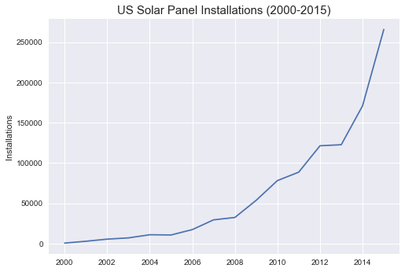


<h2>Installations by State</h2>  Installations, State


```python
## Installations vs state
state_counts=df.groupby('state')['date_installed'].count()
state_counts1=df.groupby('state')['date_installed'].count().reset_index(name="installations")


state_counts1.loc[state_counts1['installations'] < 12000, 'state'] = "Other"

s = pd.DataFrame(state_counts1.groupby('state')['installations'].sum().reset_index())
s


#create barplot using seaborn
SP_IN_S=sns.barplot(x="state", y="installations", data=s)
plt.ylabel('Installations')
plt.title("Solar Panel Installations per State(2000-2015)", fontsize=15)
plt.savefig("SPInstalls_State.png", bbox_inches='tight')
plt.show(SP_IN_S)


```


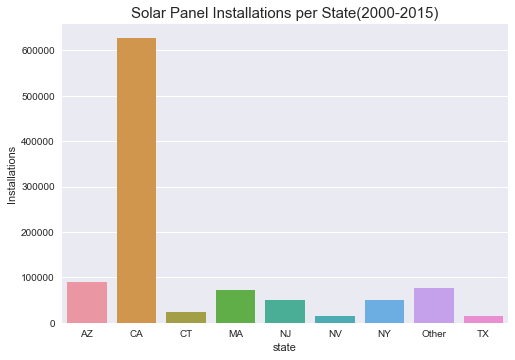


<h2>US Installations - <i>Interactive Weighted Heatmap</i></h2>


```python
zipcodes=final_df["zipcode"] 
#use for loops to add leading zeros for zipcodes for census data
zipcodes3 = [int(zipcode) for zipcode in zipcodes]
zipcodes3 = [str(zipcode) for zipcode in zipcodes3]
zipcodes3 = [str(zipcode).zfill(5) for zipcode in zipcodes3]

#groupby zipcode counts, sum instances to create a weight for the heatmap
zipcodes3=pd.DataFrame(zipcodes3)
zipcodes3
zipcodes3=zipcodes3.groupby(0)[0].count().reset_index(name="Weight")

zipcodes3 = zipcodes3.rename(columns={0:'Zipcode'})

zc = zc.rename(columns={'ZIP':'Zipcode','LAT':'Latitude','LNG':'Longitude'})

#use for loops to add leading zeros for zipcodes in zip file
zc['Zipcode'] = [int(zipcode) for zipcode in zc['Zipcode']]
zc['Zipcode'] = [str(zipcode) for zipcode in zc['Zipcode']]
zc['Zipcode'] = [str(zipcode).zfill(5) for zipcode in zc['Zipcode']]
zc.head()

#merge dataframe on key zipcode
result = pd.merge(zipcodes3, zc, how='left', on=['Zipcode'])
result=result.dropna() 
result.head()


```


<div>
<style>
    .dataframe thead tr:only-child th {
        text-align: right;
    }

    .dataframe thead th {
        text-align: left;
    }

    .dataframe tbody tr th {
        vertical-align: top;
    }
</style>
<table border="1" class="dataframe">
  <thead>
    <tr style="text-align: right;">
      <th></th>
      <th>Zipcode</th>
      <th>Weight</th>
      <th>Latitude</th>
      <th>Longitude</th>
    </tr>
  </thead>
  <tbody>
    <tr>
      <th>12</th>
      <td>00778</td>
      <td>1</td>
      <td>18.264076</td>
      <td>-65.978510</td>
    </tr>
    <tr>
      <th>14</th>
      <td>00960</td>
      <td>1</td>
      <td>18.416919</td>
      <td>-66.145795</td>
    </tr>
    <tr>
      <th>15</th>
      <td>00969</td>
      <td>1</td>
      <td>18.368062</td>
      <td>-66.108062</td>
    </tr>
    <tr>
      <th>16</th>
      <td>01001</td>
      <td>133</td>
      <td>42.062368</td>
      <td>-72.625754</td>
    </tr>
    <tr>
      <th>17</th>
      <td>01002</td>
      <td>589</td>
      <td>42.364061</td>
      <td>-72.458739</td>
    </tr>
  </tbody>
</table>
</div>


```python
#set latitude and longitude weights
locations = result[["Latitude", "Longitude"]]
weights = result["Weight"]

#center image
latlong_dict=[]
us = (37.0902, -95.7129)

fig = gmaps.figure(center=us, zoom_level=4)
fig.add_layer(gmaps.heatmap_layer(locations, weights=weights))
fig


```


<p>Failed to display Jupyter Widget of type <code>Figure</code>.</p>
<p>
  If you're reading this message in Jupyter Notebook or JupyterLab, it may mean
  that the widgets JavaScript is still loading. If this message persists, it
  likely means that the widgets JavaScript library is either not installed or
  not enabled. See the <a href="https://ipywidgets.readthedocs.io/en/stable/user_install.html">Jupyter
  Widgets Documentation</a> for setup instructions.
</p>
<p>
  If you're reading this message in another notebook frontend (for example, a static
  rendering on GitHub or <a href="https://nbviewer.jupyter.org/">NBViewer</a>),
  it may mean that your frontend doesn't currently support widgets.
</p>


<h1>Exploratory Analysis</h1>

<h3>National Total Installations -  Change Over Months</h3>


```python
#National total installation change over the months
change_over_months=df.groupby('month_installed')['date_installed'].count()
print(pd.DataFrame(change_over_months))
plt.plot(change_over_months.index, change_over_months.values)
plt.show()
```

                     date_installed
    month_installed                
    1                         76016
    2                         67403
    3                         76449
    4                         75967
    5                         78350
    6                         85066
    7                         85228
    8                         90754
    9                         90665
    10                        95539
    11                        90224
    12                       108792


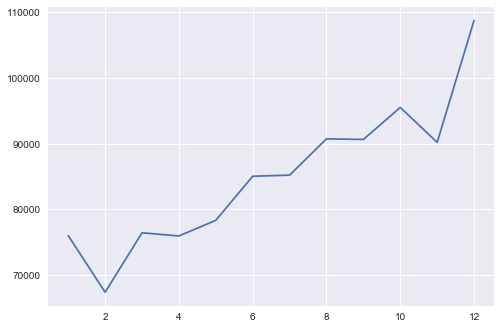


<h3>NJ Total Installations -  Change Over Years</h3>


```python
# Total installation change over the years in NJ
df_nj=df[df['state']=='NJ']
change_over_years_nj=df_nj.groupby('year_installed')['date_installed'].count()
change_over_years_nj=pd.DataFrame(change_over_years_nj)
change_over_years_nj['percent change']=change_over_years_nj['date_installed']/max(change_over_years_nj['date_installed'].values)*100
print(change_over_years_nj)
plt.plot(change_over_years_nj.index, change_over_years_nj['date_installed'])
plt.xlim(2000,2015)
plt.xlabel('Year', fontsize=20)
plt.xticks(fontsize=18)
plt.ylabel('Installations', fontsize=20)
plt.yticks(fontsize=18)
#plt.title('Installations Change over Years in NJ', fontsize=24)
#plt.legend()
plt.show()

```

                    date_installed  percent change
    year_installed                                
    2001                         3        0.030288
    2002                        40        0.403836
    2003                       101        1.019687
    2004                       307        3.099445
    2005                       768        7.753660
    2006                       932        9.409389
    2007                       744        7.511358
    2008                       943        9.520444
    2009                      1500       15.143867
    2010                      4785       48.308935
    2011                      8506       85.875820
    2012                      9445       95.355881
    2013                      6546       66.087834
    2014                      6514       65.764765
    2015                      9905      100.000000
    2016                         6        0.060575
    2017                         1        0.010096


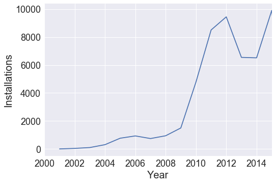


<h3>NJ Total Installations -  Change Over Months</h3>


```python
#Total installation change over the months in NJ
change_over_months_nj=df_nj.groupby('month_installed')['date_installed'].count()
print(pd.DataFrame(change_over_months_nj))
plt.plot(change_over_months_nj.index, change_over_months_nj.values)
plt.show()
```

                     date_installed
    month_installed                
    1                          3835
    2                          3553
    3                          4178
    4                          4077
    5                          3815
    6                          4264
    7                          4711
    8                          4463
    9                          4091
    10                         5183
    11                         4088
    12                         4788


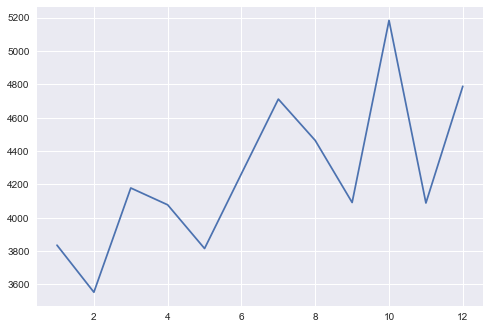


<h3>NJ - Installations vs County</h3>


```python
#Installations vs county in NJ
df_county_nj=df_nj['county'].value_counts()
df_county_nj=pd.DataFrame(df_county_nj)
df_county_nj['percent change']=df_county_nj['county']/sum(df_county_nj['county'].values)*100
print(df_county_nj)

#Installations vs county in NJ
plt.figure(figsize=(12,6))
plt.bar(range(len(df_county_nj)),df_county_nj['county'])
#plt.xlabel(df_county_nj.index), rotation=45)
plt.xticks(range(len(df_county_nj)), df_county_nj.index, fontsize=12, rotation=45)
plt.xlabel('County', fontsize=20)
plt.ylabel('Installations', fontsize=20)
#plt.xticks(fontsize=18)
plt.yticks(fontsize=18)
plt.show()
```

                county  percent change
    Ocean         9205       18.039823
    Monmouth      5173       10.137969
    Middlesex     4844        9.493200
    Burlington    4406        8.634814
    Atlantic      3214        6.298750
    Somerset      2682        5.256144
    Camden        2475        4.850468
    Gloucester    2223        4.356603
    Bergen        2131        4.176302
    Mercer        2072        4.060675
    Morris        1882        3.688316
    Essex         1585        3.106260
    Union         1539        3.016109
    Cape May      1450        2.841689
    Hunterdon     1314        2.575158
    Cumberland    1113        2.181241
    Passaic       1077        2.110689
    Sussex         726        1.422804
    Salem          661        1.295418
    Warren         652        1.277780
    Hudson         602        1.179791


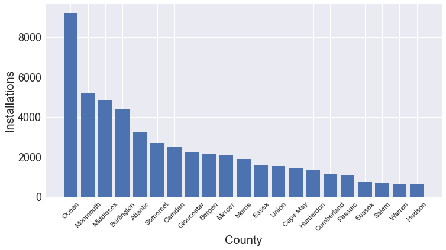


<h3>NJ Total Installations -  Change Over Years</h3>


```python
# Total installation change over the years in NJ
df_oc=df_nj[df_nj['county']=='Ocean']
change_over_years_oc=df_oc.groupby('year_installed')['date_installed'].count()
print(pd.DataFrame(change_over_years_oc))
plt.plot(change_over_years_oc.index, change_over_years_oc.values)
plt.xlabel('Year', fontsize=20)
plt.ylabel('Installations', fontsize=20)
plt.xticks(fontsize=18)
plt.yticks(fontsize=18)
plt.show()
```

                    date_installed
    year_installed                
    2002                         5
    2003                        16
    2004                        20
    2005                       128
    2006                        84
    2007                        99
    2008                        84
    2009                       156
    2010                       594
    2011                      1597
    2012                      2503
    2013                      1031
    2014                      1052
    2015                      1836


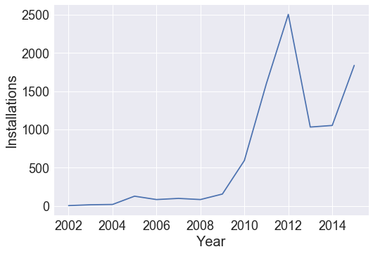


```python
#Total installation change over the months in NJ
change_over_months_oc=df_oc.groupby('month_installed')['date_installed'].count()
print(pd.DataFrame(change_over_months_oc))
plt.plot(change_over_months_oc.index, change_over_months_oc.values)
plt.show()
```

                     date_installed
    month_installed                
    1                           698
    2                           579
    3                           710
    4                           694
    5                           667
    6                           733
    7                           933
    8                           939
    9                           793
    10                          912
    11                          684
    12                          863


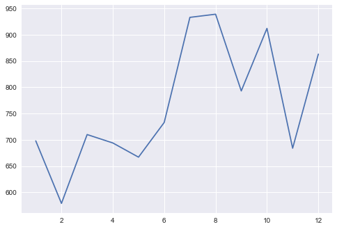


```python
#Define the function to extract the state-based census data for the years of 2011-2015
def census_state(year):
    # Census API Key
    c = Census(ckey, year=year)
    # Run Census Search to retrieve data on all states
    # Note the addition of "B23025_005E" for unemployment count
    census_data = c.acs5.get(("NAME", "B19013_001E", "B01003_001E", "B01002_001E",
                          "B19301_001E",
                          "B17001_002E",
                          "B23025_005E"), {'for': 'state:*'})

    # Convert to DataFrame
    census_pd = pd.DataFrame(census_data)

    # Column Reordering
    census_pd = census_pd.rename(columns={"B01003_001E": "Population", 
                                      "B01002_001E": "Median Age",
                                      "B19013_001E": "Household Income",
                                      "B19301_001E": "Per Capita Income",
                                      "B17001_002E": "Poverty Count",
                                      "B23025_005E": "Unemployment Count",
                                      "NAME": "Name", "state": "State"})

    # Add in Poverty Rate (Poverty Count / Population)
    census_pd["Poverty Rate"] = 100 * census_pd["Poverty Count"].astype(int) / census_pd["Population"].astype(int)

    # Add in Employment Rate (Employment Count / Population)
    census_pd["Unemployment Rate"] = 100 * census_pd["Unemployment Count"].astype(int) / census_pd["Population"].astype(int)

    # Final DataFrame
    census_pd = census_pd[["State", "Name", "Population", "Median Age", "Household Income",
                       "Per Capita Income", "Poverty Count", "Poverty Rate", "Unemployment Rate"]]

    #Add column for the year
    census_pd['year']=year
    return census_pd

#Combine the state-based census data for the years of 2011-2015
census_list1=list()
for year in range(2011, 2016):
    census_list1.append(census_state(year))
census_state=census_list1[0].append([census_list1[i] for i in range(1,5)], ignore_index=True)

#Replace the full state names with abbreviations
new_cols2=census_state.columns.drop(['State'])
census_state=census_state[new_cols2]
census_state=census_state.rename(columns={'Name':'state'})
us_state_abbrev = {
    'Alabama': 'AL',
    'Alaska': 'AK',
    'Arizona': 'AZ',
    'Arkansas': 'AR',
    'California': 'CA',
    'Colorado': 'CO',
    'Connecticut': 'CT',
    'Delaware': 'DE',
    'District of Columbia': 'DC',
    'Florida': 'FL',
    'Georgia': 'GA',
    'Hawaii': 'HI',
    'Idaho': 'ID',
    'Illinois': 'IL',
    'Indiana': 'IN',
    'Iowa': 'IA',
    'Kansas': 'KS',
    'Kentucky': 'KY',
    'Louisiana': 'LA',
    'Maine': 'ME',
    'Maryland': 'MD',
    'Massachusetts': 'MA',
    'Michigan': 'MI',
    'Minnesota': 'MN',
    'Mississippi': 'MS',
    'Missouri': 'MO',
    'Montana': 'MT',
    'Nebraska': 'NE',
    'Nevada': 'NV',
    'New Hampshire': 'NH',
    'New Jersey': 'NJ',
    'New Mexico': 'NM',
    'New York': 'NY',
    'North Carolina': 'NC',
    'North Dakota': 'ND',
    'Ohio': 'OH',
    'Oklahoma': 'OK',
    'Oregon': 'OR',
    'Pennsylvania': 'PA',
    'Puerto Rico': 'PR',
    'Rhode Island': 'RI',
    'South Carolina': 'SC',
    'South Dakota': 'SD',
    'Tennessee': 'TN',
    'Texas': 'TX',
    'Utah': 'UT',
    'Vermont': 'VT',
    'Virginia': 'VA',
    'Washington': 'WA',
    'West Virginia': 'WV',
    'Wisconsin': 'WI',
    'Wyoming': 'WY',
}
census_state=census_state.replace(us_state_abbrev)
census_state.head()

```


<div>
<style>
    .dataframe thead tr:only-child th {
        text-align: right;
    }

    .dataframe thead th {
        text-align: left;
    }

    .dataframe tbody tr th {
        vertical-align: top;
    }
</style>
<table border="1" class="dataframe">
  <thead>
    <tr style="text-align: right;">
      <th></th>
      <th>state</th>
      <th>Population</th>
      <th>Median Age</th>
      <th>Household Income</th>
      <th>Per Capita Income</th>
      <th>Poverty Count</th>
      <th>Poverty Rate</th>
      <th>Unemployment Rate</th>
      <th>year</th>
    </tr>
  </thead>
  <tbody>
    <tr>
      <th>0</th>
      <td>AL</td>
      <td>4747424</td>
      <td>37.7</td>
      <td>42934</td>
      <td>23483</td>
      <td>813385</td>
      <td>17.133186</td>
      <td>4.540210</td>
      <td>2011</td>
    </tr>
    <tr>
      <th>1</th>
      <td>AK</td>
      <td>700703</td>
      <td>33.8</td>
      <td>69014</td>
      <td>31944</td>
      <td>65111</td>
      <td>9.292239</td>
      <td>4.414424</td>
      <td>2011</td>
    </tr>
    <tr>
      <th>2</th>
      <td>AZ</td>
      <td>6337373</td>
      <td>35.7</td>
      <td>50752</td>
      <td>25784</td>
      <td>1003575</td>
      <td>15.835820</td>
      <td>4.234610</td>
      <td>2011</td>
    </tr>
    <tr>
      <th>3</th>
      <td>AR</td>
      <td>2895928</td>
      <td>37.3</td>
      <td>40149</td>
      <td>21833</td>
      <td>516822</td>
      <td>17.846507</td>
      <td>3.940015</td>
      <td>2011</td>
    </tr>
    <tr>
      <th>4</th>
      <td>CA</td>
      <td>36969200</td>
      <td>35.1</td>
      <td>61632</td>
      <td>29634</td>
      <td>5211481</td>
      <td>14.096818</td>
      <td>5.055211</td>
      <td>2011</td>
    </tr>
  </tbody>
</table>
</div>


```python

df_2015=final_df[final_df['year_installed']==2015] 
df_2015.head()
df1=pd.DataFrame(df_2015.groupby('state')['date_installed'].count())
df1=df1.rename(columns={'date_installed': 'ins. counts'})
census_state_2015=census_state[census_state['year']==2015]
df1=df1.reset_index()
census_state_2015
state_count_df=pd.merge(df1, census_state_2015, on='state', how='right')
state_count_df.head()
```


<div>
<style>
    .dataframe thead tr:only-child th {
        text-align: right;
    }

    .dataframe thead th {
        text-align: left;
    }

    .dataframe tbody tr th {
        vertical-align: top;
    }
</style>
<table border="1" class="dataframe">
  <thead>
    <tr style="text-align: right;">
      <th></th>
      <th>state</th>
      <th>ins. counts</th>
      <th>Population</th>
      <th>Median Age</th>
      <th>Household Income</th>
      <th>Per Capita Income</th>
      <th>Poverty Count</th>
      <th>Poverty Rate</th>
      <th>Unemployment Rate</th>
      <th>year</th>
    </tr>
  </thead>
  <tbody>
    <tr>
      <th>0</th>
      <td>AL</td>
      <td>1.0</td>
      <td>4.83062e+06</td>
      <td>38.4</td>
      <td>43623</td>
      <td>24091</td>
      <td>887260</td>
      <td>18.367415</td>
      <td>4.287172</td>
      <td>2015</td>
    </tr>
    <tr>
      <th>1</th>
      <td>AZ</td>
      <td>17105.0</td>
      <td>6.64193e+06</td>
      <td>36.8</td>
      <td>50255</td>
      <td>25848</td>
      <td>1.18069e+06</td>
      <td>17.776314</td>
      <td>4.151084</td>
      <td>2015</td>
    </tr>
    <tr>
      <th>2</th>
      <td>CA</td>
      <td>160045.0</td>
      <td>3.84215e+07</td>
      <td>35.8</td>
      <td>61818</td>
      <td>30318</td>
      <td>6.13514e+06</td>
      <td>15.968007</td>
      <td>4.921939</td>
      <td>2015</td>
    </tr>
    <tr>
      <th>3</th>
      <td>CO</td>
      <td>6.0</td>
      <td>5.27891e+06</td>
      <td>36.3</td>
      <td>60629</td>
      <td>32217</td>
      <td>653969</td>
      <td>12.388343</td>
      <td>3.704896</td>
      <td>2015</td>
    </tr>
    <tr>
      <th>4</th>
      <td>CT</td>
      <td>8342.0</td>
      <td>3.59322e+06</td>
      <td>40.4</td>
      <td>70331</td>
      <td>38803</td>
      <td>366351</td>
      <td>10.195613</td>
      <td>4.794917</td>
      <td>2015</td>
    </tr>
  </tbody>
</table>
</div>


```python
#plot state vs normalized counts (counts per 10,000 populations)
norm_counts=state_count_df['ins. counts']/state_count_df['Population'].astype(int)*10000
plt.figure(figsize=(16,6))
plt.bar(range(len(state_count_df)),norm_counts, label="2015")
#plt.xticks(x, labels, rotation='vertical')
plt.xticks(range(len(state_count_df)), state_count_df['state'], fontsize=12, rotation=45)
#plt.xlabel('State', fontsize=20)
#plt.xticks(fontsize=14)
plt.ylabel('Installations', fontsize=20)
plt.yticks(fontsize=18)
#plt.title('State vs Normalized Installations (2015)', fontsize=24)
#plt.legend()
plt.show()
```


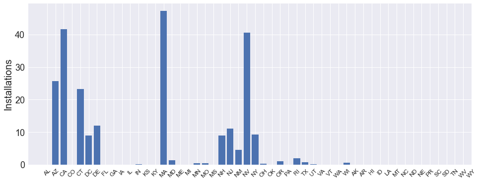


```python
df_2015=df_2015[['zipcode', 'date_installed','population','median age','household income']]
df_2015=df_2015.dropna()
len(df_2015)
```


    264799


<h2>Population Analysis</h2>


```python
#2015 data for scatter plot analysis
ins_counts_zip=df_2015.groupby('zipcode')['date_installed'].count()
pop_zip=df_2015.groupby('zipcode')['population'].unique()
age_zip=df_2015.groupby('zipcode')['median age'].unique()
income_zip=df_2015.groupby('zipcode')['household income'].unique()
#Generate the summary table for more analysis
df_zip=pd.DataFrame(ins_counts_zip)
df_zip['age']=age_zip.astype(int)
df_zip['population']=pop_zip.astype(int)
df_zip['household income']=income_zip.astype(int)
df_zip=df_zip.rename(columns={'date_installed':'ins counts'})
df_zip.head()

```


<div>
<style>
    .dataframe thead tr:only-child th {
        text-align: right;
    }

    .dataframe thead th {
        text-align: left;
    }

    .dataframe tbody tr th {
        vertical-align: top;
    }
</style>
<table border="1" class="dataframe">
  <thead>
    <tr style="text-align: right;">
      <th></th>
      <th>ins counts</th>
      <th>age</th>
      <th>population</th>
      <th>household income</th>
    </tr>
    <tr>
      <th>zipcode</th>
      <th></th>
      <th></th>
      <th></th>
      <th></th>
    </tr>
  </thead>
  <tbody>
    <tr>
      <th>1001.0</th>
      <td>76</td>
      <td>44</td>
      <td>17438</td>
      <td>60161</td>
    </tr>
    <tr>
      <th>1002.0</th>
      <td>174</td>
      <td>23</td>
      <td>29780</td>
      <td>50540</td>
    </tr>
    <tr>
      <th>1005.0</th>
      <td>51</td>
      <td>43</td>
      <td>5201</td>
      <td>68786</td>
    </tr>
    <tr>
      <th>1007.0</th>
      <td>304</td>
      <td>42</td>
      <td>14838</td>
      <td>76881</td>
    </tr>
    <tr>
      <th>1008.0</th>
      <td>6</td>
      <td>49</td>
      <td>1171</td>
      <td>70417</td>
    </tr>
  </tbody>
</table>
</div>


```python
#Calculate the correlation coefficiency
print(df_zip.corr())
min(pop_zip.astype(int))
```

                      ins counts       age  population  household income
    ins counts          1.000000 -0.167640    0.454405          0.070810
    age                -0.167640  1.000000   -0.459336          0.197061
    population          0.454405 -0.459336    1.000000         -0.067173
    household income    0.070810  0.197061   -0.067173          1.000000


    43


```python
#plot population vs ins counts by zipcode
plt.figure(figsize=(12,8))
#plt.scatter(pop_zip.astype(int),ins_counts_zip, label="2015 by zipcode")
ax = sns.regplot(x=pop_zip.astype(int), y=ins_counts_zip)
#plt.xlim(0,2.6e7)
plt.xlabel('Population', fontsize=20)
plt.xticks(fontsize=18)
plt.ylabel('Installations', fontsize=20)
plt.yticks(fontsize=18)
plt.title('Population vs Installations by Zipcode (2015)', fontsize=24)
#plt.legend()
plt.show()
```


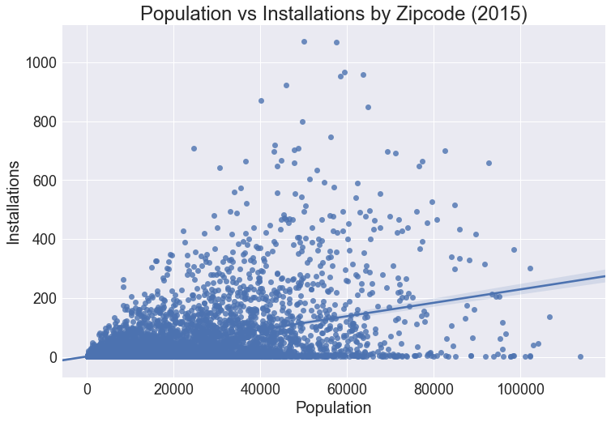


```python
#Statistical Analysis for Population vs Installations
#Three subsets of the population group
df_zip_lt40kp=df_zip[df_zip['population']< 40000]
df_zip_40k_70kp=df_zip[(df_zip['population']>= 40000) & (df_zip['population'] < 70000)]
df_zip_gt70kp=df_zip[df_zip['population']>= 70000]
#Mean values
mean_lt40kp = df_zip_lt40kp['ins counts'].mean()
mean_40k_70kp=df_zip_40k_70kp['ins counts'].mean()
mean_gt70kp=df_zip_gt70kp['ins counts'].mean()
print(mean_lt40kp)
print(mean_40k_70kp)
print(mean_gt70kp)
# Plot the population vs installation data
plt.scatter(df_zip_lt40kp['population'], df_zip_lt40kp['ins counts'], c="r", label="< 40k")
plt.scatter(df_zip_40k_70kp['population'], df_zip_40k_70kp['ins counts'], c="g", label="40k-70k")
plt.scatter(df_zip_gt70kp['population'], df_zip_gt70kp['ins counts'], c="b", label="> 70k")
plt.legend(loc="best")
plt.xlabel("population")
plt.ylabel("Installations")
plt.title("Installations vs Population")
plt.show()
```

    30.178047839506174
    127.80028129395218
    163.45794392523365


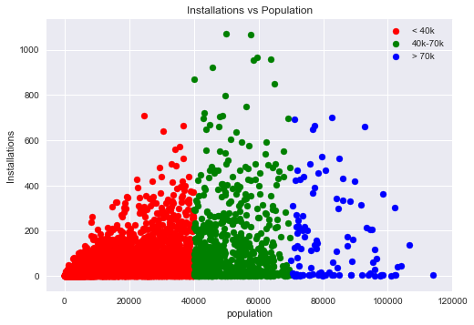


```python
# Perform the ANOVA
anova_pop=stats.f_oneway(df_zip_lt40kp['ins counts'],df_zip_40k_70kp['ins counts'],df_zip_gt70kp['ins counts'])
anova_pop
```


    F_onewayResult(statistic=511.50428701940319, pvalue=7.7039032243146832e-206)


```python
# Run 2-Sample T-Test: 40k vs 70k+ population
ttest_pop1=stats.ttest_ind(df_zip_lt40kp['ins counts'],df_zip_40k_70kp['ins counts'], equal_var=False)
ttest_pop1
```


    Ttest_indResult(statistic=-14.752235001588431, pvalue=2.5625687065220282e-43)


```python


# Run 2-Sample T-Test: 40k vs 70k+ population
ttest_pop2=stats.ttest_ind(df_zip_lt40kp['ins counts'],df_zip_gt70kp['ins counts'], equal_var=False)
ttest_pop2
```


    Ttest_indResult(statistic=-7.2355486548060926, pvalue=7.497618789312924e-11)


```python

# Run 2-Sample T-Test: 40k-70k vs 70k+ population
ttest_pop3=stats.ttest_ind(df_zip_gt70kp['ins counts'],df_zip_40k_70kp['ins counts'], equal_var=False)
ttest_pop3
```


    Ttest_indResult(statistic=1.8250736812929107, pvalue=0.070210715958278824)


```python

#Generate a dataframe to summarize the stats results for the population analysis
pop_gps=['< 40k','40-70k','> 70k']
stat_tests=['ANOVA', "2-Sample T-Test", "2-Sample T-Test", "2-Sample T-Test"]
groups=['<40k, 40-70k, >70k','<40k vs 40-70k', '<40k vs >70k', '40-70k vs >70k']
p_values=[anova_pop[1], ttest_pop1[1],ttest_pop2[1],ttest_pop3[1]]

stat_pop=pd.DataFrame({"Stat Test": stat_tests, "Groups": groups, "p Value": p_values})
stat_pop=stat_pop[['Stat Test','Groups','p Value']]
stat_pop['p Value']=stat_pop['p Value'].round(2)
stat_pop

```


<div>
<style>
    .dataframe thead tr:only-child th {
        text-align: right;
    }

    .dataframe thead th {
        text-align: left;
    }

    .dataframe tbody tr th {
        vertical-align: top;
    }
</style>
<table border="1" class="dataframe">
  <thead>
    <tr style="text-align: right;">
      <th></th>
      <th>Stat Test</th>
      <th>Groups</th>
      <th>p Value</th>
    </tr>
  </thead>
  <tbody>
    <tr>
      <th>0</th>
      <td>ANOVA</td>
      <td>&lt;40k, 40-70k, &gt;70k</td>
      <td>0.00</td>
    </tr>
    <tr>
      <th>1</th>
      <td>2-Sample T-Test</td>
      <td>&lt;40k vs 40-70k</td>
      <td>0.00</td>
    </tr>
    <tr>
      <th>2</th>
      <td>2-Sample T-Test</td>
      <td>&lt;40k vs &gt;70k</td>
      <td>0.00</td>
    </tr>
    <tr>
      <th>3</th>
      <td>2-Sample T-Test</td>
      <td>40-70k vs &gt;70k</td>
      <td>0.07</td>
    </tr>
  </tbody>
</table>
</div>


```python
#Plot bar graph for the mean counts vs population groups
pop_gps=['< 40k','40-70k','> 70k']
#plt.bar(x_axis, users, color='r', alpha=0.5, align="edge")
tick_locations = [value+0.4 for value in range(3)]
plt.xticks(tick_locations, pop_gps)
plt.bar(range(3),[mean_lt40kp,mean_40k_70kp,mean_gt70kp], alpha=0.8, align='edge')
plt.xlabel("population")
plt.ylabel("Installations")
plt.title("Installations vs Population")
plt.show()
```


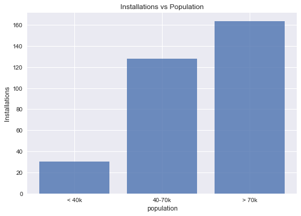


<h2>Age Group Analysis</h2>


```python
#plot scatter plot for age vs installations
plt.figure(figsize=(12,8))
#plt.scatter(age_zip.astype(int),ins_counts_zip, label="2015 by zipcode")
ax = sns.regplot(x=age_zip.astype(int), y=ins_counts_zip)
#plt.xlim(0,2.6e7)
plt.xlabel('Age', fontsize=20)
plt.xticks(fontsize=18)
plt.ylabel('Installations', fontsize=20)
plt.yticks(fontsize=18)
plt.title('Age vs Installations by Zipcode (2015)', fontsize=24)
#plt.legend()
plt.show()
```


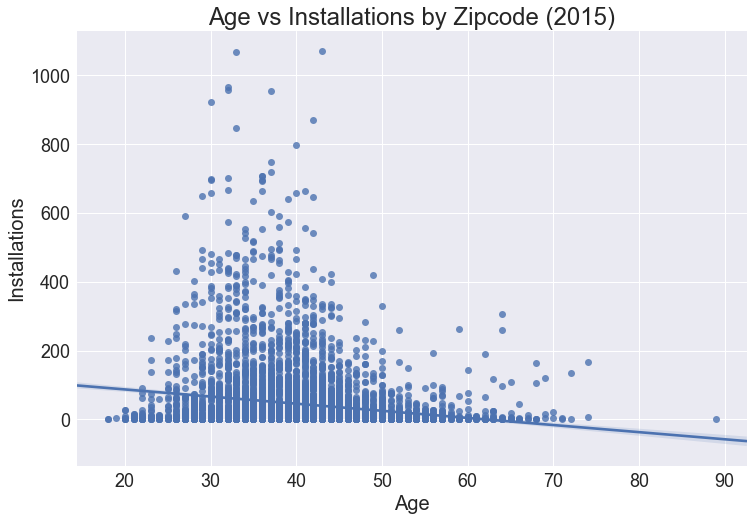


```python
#Two subsets of the age group
df_zip_lt45=df_zip[df_zip['age']<=45]
df_zip_gt45=df_zip[df_zip['age']> 45]
#Mean values
mean_lt45=df_zip_lt45['ins counts'].mean()
mean_gt45=df_zip_gt45['ins counts'].mean()
print(mean_lt45)
print(mean_gt45)
# Plot the Data in groups
plt.scatter(df_zip_lt45['age'], df_zip_lt45['ins counts'], c="g", label="< 45 years old")
plt.scatter(df_zip_gt45['age'], df_zip_gt45['ins counts'], c="r", label=">= 45 years old")
plt.legend(loc="best")
plt.xlabel("Age")
plt.ylabel("Installations")
plt.title("Installations vs Age")
plt.show()
```

    50.961063829787236
    19.417818740399387


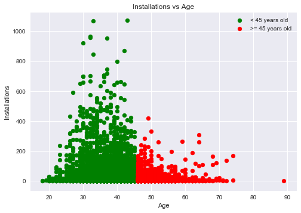


```python
# Run 2-Sample T-Test
stats.ttest_ind(df_zip_lt45['ins counts'],df_zip_gt45['ins counts'], equal_var=False)
```


    Ttest_indResult(statistic=17.174304560603659, pvalue=2.0069322358745673e-64)


```python
#Plot bar graph for mean installations vs age
tick_locations = [value+0.4 for value in range(2)]
plt.xticks(tick_locations, ['< 45 years old', '>= 45 years old'])
plt.bar(range(2),[mean_lt45,mean_gt45], alpha=0.8, align='edge')
plt.title("Age vs Installations")
plt.xlabel("Age")
plt.ylabel("Installations")
plt.show()
#plt.savefig('income_vs_counts'
```


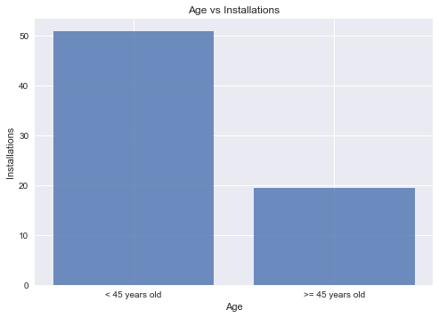


<h2>Income Analysis</h2>


```python
#plot income vs ins counts by zipcode
plt.figure(figsize=(12,8))
ax = sns.regplot(x=income_zip.astype(int), y=ins_counts_zip)
#plt.xlim(0,2.6e7)
plt.xlabel('Household Income', fontsize=20)
plt.xticks(fontsize=18)
plt.ylabel('Installations', fontsize=20)
plt.yticks(fontsize=18)
plt.title('Household Income vs Installations by Zipcode (2015)', fontsize=24)
#plt.legend()
plt.show()
```


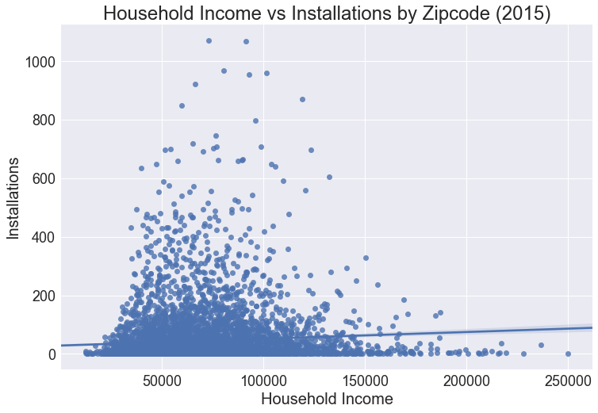


```python
#Three subsets of the income group
df_zip_lt40k=df_zip[df_zip['household income']< 40000]
df_zip_40k_120k=df_zip[(df_zip['household income']>= 40000) & (df_zip['household income'] < 120000)]
df_zip_gt120k=df_zip[df_zip['household income']>= 120000]

mean_lt40k_ic=df_zip_lt40k['ins counts'].mean()
mean_40k_120K_ic=df_zip_40k_120k['ins counts'].mean()
mean_gt120k_ic=df_zip_gt120k['ins counts'].mean()
print(mean_lt40k_ic)
print(mean_40k_120K_ic)
print(mean_gt120k_ic)
```

    24.763736263736263
    47.14571140262361
    41.26645768025078


```python
# Plot the income vs counts data
plt.scatter(df_zip_lt40k['household income'], df_zip_lt40k['ins counts'], c="r", label="< 40k")
plt.scatter(df_zip_40k_120k['household income'], df_zip_40k_120k['ins counts'], c="g", label="40k-120k")
plt.scatter(df_zip_gt120k['household income'], df_zip_gt120k['ins counts'], c="b", label="> 120k")
plt.legend(loc="best")
plt.xlabel("Household Income")
plt.ylabel("Installations")
plt.title("Installations vs Household Income")
plt.show()
```


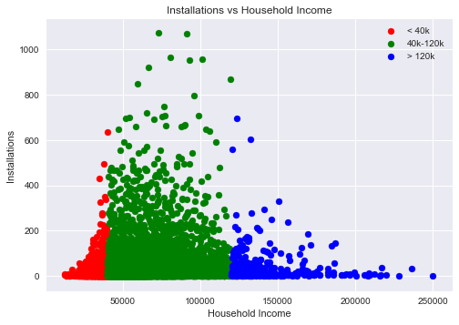


```python
# Perform the ANOVA
anova_income=stats.f_oneway(df_zip_lt40k['ins counts'],df_zip_40k_120k['ins counts'],df_zip_gt120k['ins counts'])
anova_income
```


    F_onewayResult(statistic=18.777882919096719, pvalue=7.4180535270863943e-09)


```python
gp1=df_zip_lt40k['ins counts']
gp2=df_zip_40k_120k['ins counts']
gp3=df_zip_gt120k['ins counts']
```


```python
# Run 2-Sample T-Test
ttest_income1=stats.ttest_ind(gp1,gp2, equal_var=False)
ttest_income1
```


    Ttest_indResult(statistic=-8.9803611202683413, pvalue=8.0309878551985174e-19)


```python
ttest_income2=stats.ttest_ind(gp2,gp3, equal_var=False)
ttest_income2
```


    Ttest_indResult(statistic=1.2590964459819312, pvalue=0.2087646463966191)


```python
ttest_income3=stats.ttest_ind(gp1,gp3, equal_var=False)
ttest_income3
```


    Ttest_indResult(statistic=-3.3552797709565199, pvalue=0.00085836787278917336)


```python
#Generate a dataframe to summarize the stats results for the household income analysis
income_gps=['< 40k','40-120k','> 120k']
stat_tests_ic=['ANOVA', "2-Sample T-Test", "2-Sample T-Test", "2-Sample T-Test"]
groups_ic=['<40k, 40-120k, >120k','<40k vs 40-120k', '<40-120k vs >120k', '<40 vs >120k']
p_values_ic=[anova_income[1], ttest_income1[1],ttest_income2[1],ttest_income3[1]]

stat_income=pd.DataFrame({"Stat Test": stat_tests_ic, "Groups": groups_ic, "p Value": p_values_ic})
stat_income=stat_income[['Stat Test','Groups','p Value']]
stat_income['p Value']=stat_income['p Value'].round(2)
stat_income
```


<div>
<style>
    .dataframe thead tr:only-child th {
        text-align: right;
    }

    .dataframe thead th {
        text-align: left;
    }

    .dataframe tbody tr th {
        vertical-align: top;
    }
</style>
<table border="1" class="dataframe">
  <thead>
    <tr style="text-align: right;">
      <th></th>
      <th>Stat Test</th>
      <th>Groups</th>
      <th>p Value</th>
    </tr>
  </thead>
  <tbody>
    <tr>
      <th>0</th>
      <td>ANOVA</td>
      <td>&lt;40k, 40-120k, &gt;120k</td>
      <td>0.00</td>
    </tr>
    <tr>
      <th>1</th>
      <td>2-Sample T-Test</td>
      <td>&lt;40k vs 40-120k</td>
      <td>0.00</td>
    </tr>
    <tr>
      <th>2</th>
      <td>2-Sample T-Test</td>
      <td>&lt;40-120k vs &gt;120k</td>
      <td>0.21</td>
    </tr>
    <tr>
      <th>3</th>
      <td>2-Sample T-Test</td>
      <td>&lt;40 vs &gt;120k</td>
      <td>0.00</td>
    </tr>
  </tbody>
</table>
</div>


```python
#Plot bar graph for the mean counts vs income groups
tick_locations = [value+0.4 for value in range(3)]
plt.xticks(tick_locations, income_gps)
plt.bar(range(3),[mean_lt40k_ic,mean_40k_120K_ic,mean_gt120k_ic], alpha=0.8, align='edge')
plt.xlabel("Household Income")
plt.ylabel("Installations")
plt.title("Installations vs Household Income")
plt.show()
#plt.savefig('income_vs_counts')
```


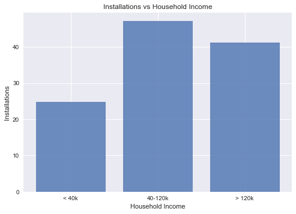

